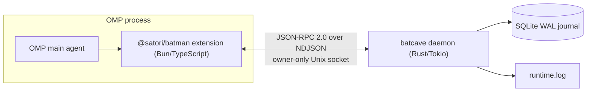

# B.A.T.M.A.N.

(**B**orderline **A**wesome **T**ool for **M**ultiagent **A**utomation by **N**ikolas.)

BATMAN is an [Oh My Pi (OMP)](https://github.com/can1357/oh-my-pi) extension backed by a durable,
repository-scoped local daemon. OMP stays the brain — task intake, scheduling, worker selection,
approvals, merge decisions, synthesis. BATMAN is the hands: it supervises worker processes, speaks
harness adapter protocols, persists a durable event journal, recovers after crashes, and feeds
display backends. Everything is delivered as an external npm package (`@satori/batman`) plus a
Rust daemon binary (`batcave`) — no OMP fork, no private APIs.

## Current status: M1 / Orchestration Extension complete

The foundation vertical slice and the orchestration extension are both implemented and verified
end to end:

> OMP loads `@satori/batman`, starts or reconnects to `batcave`, negotiates protocol 1.0 over an
> owner-only Unix socket, persists and replays redacted events in SQLite, and returns runtime
> status through the `batman_status` tool — all without a model call. On top of that: stable
> task/worker/run records with an enforced lifecycle, six OMP-facing orchestration tools
> (`batman_task`, `batman_worker`, `batman_run`, `batman_message`, `batman_approval`,
> `batman_reconcile`), OMP-native subagent reconciliation, an audited worker-safe coordination
> broker, a correlated human-approval flow, and an embedded `/batman` monitor that replays and
> live-updates task/run state — all backed by one durable event journal, with no task-graph,
> retry, worker-selection, or merge decision made inside Rust.

Display backends (herdr, tmux, terminal) are implemented and wired into the daemon's lifecycle via `AdapterRegistry`. The registry is constructed with `FixtureAuthorization { allow: true }` at daemon startup, enabling supervised adapters to start runs, forward follow-up messages, and track artifacts as JSON values. Nothing in this repository calls a model.

## How it fits together



- **One daemon per repository.** Every OMP session in the same canonical repository connects to the
  same `batcave`; different repositories get isolated sockets, databases, and locks. A kernel
  `flock` guarantees the singleton.
- **Rust owns the wire contract.** All protocol types live in `crates/protocol`; JSON Schema and
  TypeScript bindings are generated from them and committed. Generated files are never hand-edited.
- **Redaction before persistence.** Secrets and hidden reasoning are dropped or masked *before*
  anything reaches SQLite, the WAL, or the log — enforced by construction (the journal only accepts
  types that cannot be built without passing through the redactor).

## Repository layout

```
crates/protocol/          Canonical Rust wire types (source of truth for the protocol)
crates/runtime/           The batcave daemon: CLI, lifecycle, IPC server, SQLite journal, security,
                          domain persistence, orchestration/coordination/approval services
crates/xtask/             Codegen (schema + TS bindings) and platform package assembly
packages/extension/       The OMP extension: client, launcher, platform loader, orchestration
                          tools, OMP-native reconciliation, embedded /batman monitor
packages/protocol-ts/     Generated TypeScript bindings + JSON Schema + Ajv validators
packages/batman-*/        Per-platform binary leaf packages (npm optionalDependencies)
fixtures/                 Cross-language golden fixtures (protocol frames, state roots, repo ids)
docs/                     Engineering documentation (start here: docs/getting-started.md)
```

## Quick start

Prerequisites: **Rust 1.97+**, **Bun 1.3.14+**, macOS or glibc Linux on arm64/x64.
To exercise the OMP integration you also need **OMP ≥ 17.0.7** (`omp` on your PATH).

```bash
bun install                 # link workspaces, install extension deps
bun run check               # schema drift check + build + all Bun and Rust tests
cargo build -p batman-runtime

# Talk to the daemon directly:
./target/debug/batcave serve --foreground --state-dir /tmp/batman-state --repo "$PWD" --idle-seconds 30 &
./target/debug/batcave status --wait-seconds 5 --state-dir /tmp/batman-state --repo "$PWD"
./target/debug/batcave stop --state-dir /tmp/batman-state --repo "$PWD"

# Or through OMP (the real vertical slice):
OMP_BATMAN_BINARY="$PWD/target/debug/batcave" \
  omp --extension ./packages/extension/src/index.ts --print "/batman-status"
```

The OMP command prints the runtime status (protocol 1.0, project id, schema version) with no model
call; running it twice reconnects to the same daemon instead of starting a second one.

Orchestration tools need a model call (they're regular OMP tools, not slash commands) — start an
interactive session and ask the model to use `batman_task`, `batman_worker`, and `batman_run`, then
open `/batman` to watch the run's state live:

```bash
OMP_BATMAN_BINARY="$PWD/target/debug/batcave" \
  omp --extension ./packages/extension/src/index.ts
# then, inside the session: "create a task, a worker, and submit a run with batman_task/
# batman_worker/batman_run, then run /batman"
```

Without a wired adapter (this repository never implements one), `run/submit` reports
`adapter_unavailable` and the run stays `queued` — the monitor still shows it, live, via the same
durable event stream. See [docs/manual-testing.md](docs/manual-testing.md) for the full
walkthrough, including messages and the two properties ("live broadcast" and "replay after
restart") that walkthrough actually proves.

## Documentation

| Document | Read it when you want to… |
|---|---|
| [docs/getting-started.md](docs/getting-started.md) | build and run automated tests; environment variables; common workflows |
| [docs/manual-testing.md](docs/manual-testing.md) | run the daemon, the extension, and OMP tools by hand — the checks nothing in CI performs |
| [docs/journal.md](docs/journal.md) | read the story of how this got built, commit by commit — the decisions, the whys, and the hows |
| [docs/adr/](docs/adr/) | look up a specific architectural decision (MADR format) — what was decided, what was considered, and why |
| [docs/architecture.md](docs/architecture.md) | understand the design: protocol, codegen, journal, redaction, IPC, lifecycle, domain persistence, orchestration RPC, coordination, approvals, the monitor |
| [docs/code-walkthrough.md](docs/code-walkthrough.md) | navigate the source, trace a request end to end, debug, and find the right test |
| [docs/rust-primer.md](docs/rust-primer.md) | learn Rust fast, using this repository's own code as the textbook (a one-week plan) |

## Non-negotiable invariants

These hold everywhere in the codebase; changes that weaken them will be rejected in review:

1. Rust types are canonical; `packages/protocol-ts/src/generated/` and
   `packages/protocol-ts/schema/batman.schema.json` are build outputs (`bun run generate`).
2. TypeScript validates **every** message received from the daemon with Ajv before it reaches
   extension logic.
3. SQLite runs with WAL, foreign keys, `synchronous=FULL`, and atomic versioned migrations; the
   event journal is append-only.
4. Intent is persisted before side effects; content is redacted before it becomes durable.
5. Supported platforms are macOS and glibc Linux on arm64/x64 — everything else is rejected with a
   typed error, never a silent fallback.
6. OMP owns the task graph, scheduling, worker selection, policy, approvals, and merge/synthesis
   decisions — Rust never creates or edits OMP's task graph; a retry always creates a new run and
   a harness replacement always creates a new worker and run.
7. Every domain mutation commits its event and broadcasts the same `EventEnvelope` to live
   `events/subscribe` listeners in the same call — a mutation that appends without broadcasting
   silently breaks the embedded monitor (see [`docs/engineering-lessons.md`](docs/engineering-lessons.md#durable-mutations-must-broadcast-the-same-event-they-just-committed)).

## License

This project is licensed under the [MIT License](LICENSE). See the LICENSE file for full terms.
