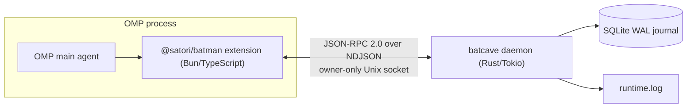

# B.A.T.M.A.N.

**B**orderline **A**wesome **T**ool for **M**ultiagent **A**utomation by **N**ikolas.

BATMAN is an [Oh My Pi (OMP)](https://github.com/can1357/oh-my-pi) extension backed by a durable,
repository-scoped local daemon. OMP stays the brain — task intake, scheduling, worker selection,
approvals, merge decisions, synthesis. BATMAN is the hands: it supervises worker processes, speaks
harness adapter protocols, persists a durable event journal, recovers after crashes, and feeds
display backends. Everything is delivered as an external npm package (`@satori/batman`) plus a
Rust daemon binary (`batcave`) — no OMP fork, no private APIs.

## Current status: M0 / Foundation complete

The foundation vertical slice is implemented and verified end to end:

> OMP loads `@satori/batman`, starts or reconnects to `batcave`, negotiates protocol 1.0 over an
> owner-only Unix socket, persists and replays a redacted event in SQLite, and returns runtime
> status through the `batman_status` tool — without a model call.

Worker adapters, workspaces, displays, and orchestration records are later milestones (see the
roadmap in the project design documents). Nothing in this repository calls a model.

## How it fits together



- **One daemon per repository.** Every OMP session in the same canonical repository connects to the
  same `batcave`; different repositories get isolated sockets, databases, and locks. A kernel
  `flock` guarantees the singleton.
- **Rust owns the wire contract.** All protocol types live in `crates/protocol`; JSON Schema and
  TypeScript bindings are generated from them and committed. Generated files are never hand-edited.
- **Redaction before persistence.** Secrets and hidden reasoning are dropped or masked *before*
  anything reaches SQLite, the WAL, or the log — enforced by construction (the journal only accepts
  types that cannot be built without passing through the redactor).

## Repository layout

```
crates/protocol/          Canonical Rust wire types (source of truth for the protocol)
crates/runtime/           The batcave daemon: CLI, lifecycle, IPC server, SQLite journal, security
crates/xtask/             Codegen (schema + TS bindings) and platform package assembly
packages/extension/       The OMP extension: client, launcher, platform loader, batman_status tool
packages/protocol-ts/     Generated TypeScript bindings + JSON Schema + Ajv validators
packages/batman-*/        Per-platform binary leaf packages (npm optionalDependencies)
fixtures/                 Cross-language golden fixtures (protocol frames, state roots, repo ids)
docs/                     Engineering documentation (start here: docs/getting-started.md)
```

## Quick start

Prerequisites: **Rust 1.97+**, **Bun 1.3.14+**, macOS or glibc Linux on arm64/x64.
To exercise the OMP integration you also need **OMP ≥ 17.0.7** (`omp` on your PATH).

```bash
bun install                 # link workspaces, install extension deps
bun run check               # schema drift check + build + all Bun and Rust tests
cargo build -p batman-runtime

# Talk to the daemon directly:
./target/debug/batcave serve --foreground --state-dir /tmp/batman-state --repo "$PWD" --idle-seconds 30 &
./target/debug/batcave status --wait-seconds 5 --state-dir /tmp/batman-state --repo "$PWD"
./target/debug/batcave stop --state-dir /tmp/batman-state --repo "$PWD"

# Or through OMP (the real vertical slice):
OMP_BATMAN_BINARY="$PWD/target/debug/batcave" \
  omp --extension ./packages/extension/src/index.ts --print "/batman-status"
```

The OMP command prints the runtime status (protocol 1.0, project id, schema version) with no model
call; running it twice reconnects to the same daemon instead of starting a second one.

## Documentation

| Document | Read it when you want to… |
|---|---|
| [docs/getting-started.md](docs/getting-started.md) | build, test, and run the codebase; environment variables; common workflows |
| [docs/architecture.md](docs/architecture.md) | understand the design: protocol, codegen, journal, redaction, IPC, lifecycle |
| [docs/code-walkthrough.md](docs/code-walkthrough.md) | navigate the source, trace a request end to end, debug, and find the right test |
| [docs/rust-primer.md](docs/rust-primer.md) | learn Rust fast, using this repository's own code as the textbook (a one-week plan) |

## Non-negotiable invariants

These hold everywhere in the codebase; changes that weaken them will be rejected in review:

1. Rust types are canonical; `packages/protocol-ts/src/generated/` and
   `packages/protocol-ts/schema/batman.schema.json` are build outputs (`bun run generate`).
2. TypeScript validates **every** message received from the daemon with Ajv before it reaches
   extension logic.
3. SQLite runs with WAL, foreign keys, `synchronous=FULL`, and atomic versioned migrations; the
   event journal is append-only.
4. Intent is persisted before side effects; content is redacted before it becomes durable.
5. Supported platforms are macOS and glibc Linux on arm64/x64 — everything else is rejected with a
   typed error, never a silent fallback.
