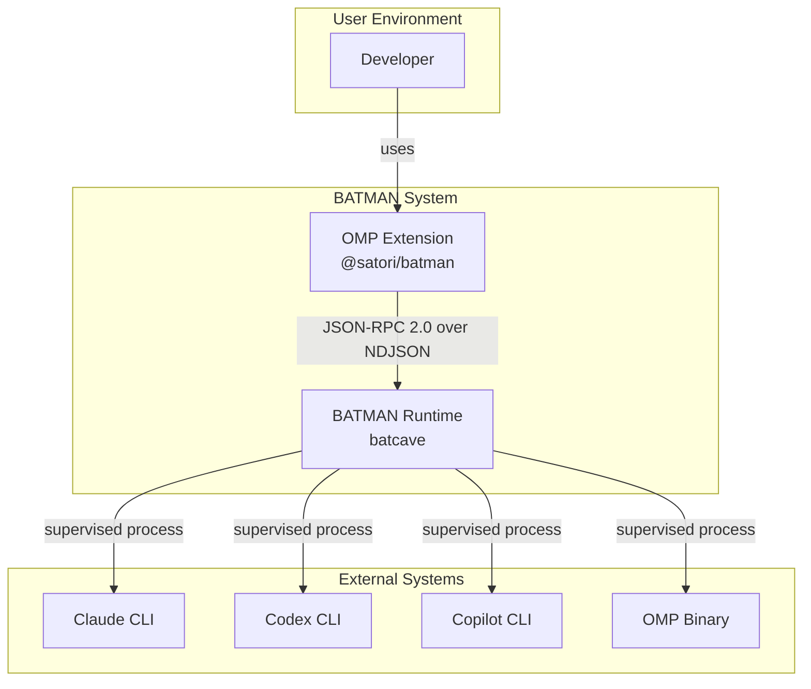
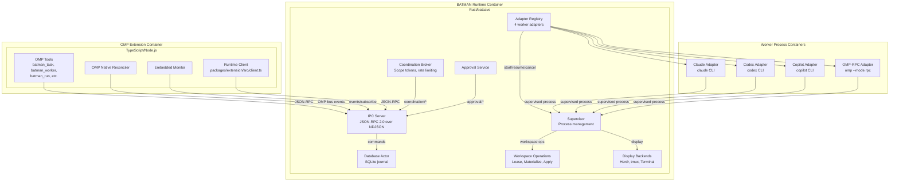
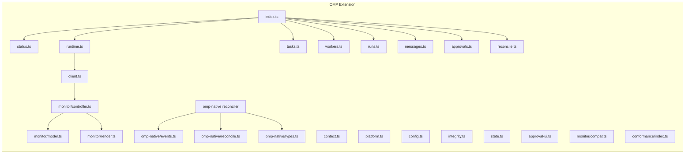
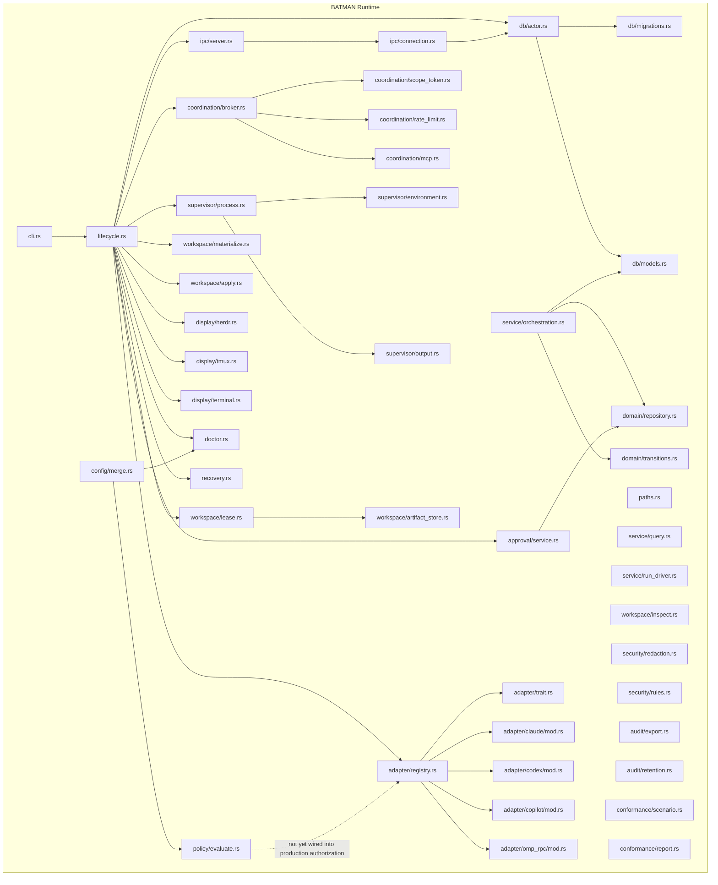
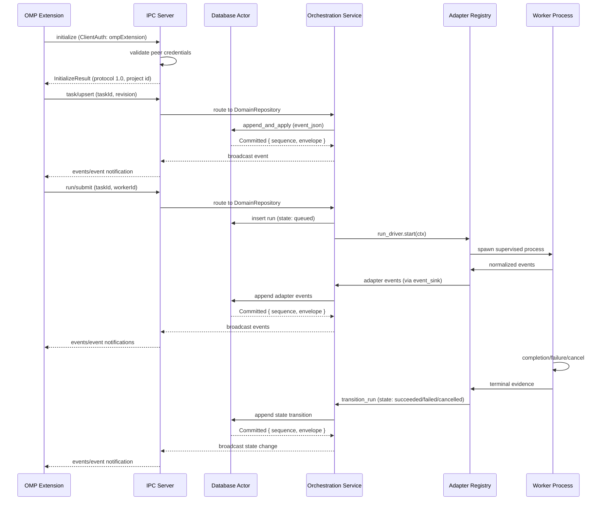

# Architecture

This document explains how the foundation of BATMAN is designed and why. It assumes you have read
the [README](../README.md) and want the engineering detail behind it.

**Related ADRs:** [0001](adr/0001-omp-extension-with-separate-rust-daemon.md),
[0002](adr/0002-rust-canonical-protocol-with-generated-bindings.md),
[0003](adr/0003-sqlite-as-the-sole-persistence-engine.md),
[0004](adr/0004-json-rpc-2-over-bounded-ndjson-on-a-unix-socket.md),
[0005](adr/0005-single-thread-actor-owns-the-sqlite-connection.md),
[0006](adr/0006-type-enforced-redaction-boundary.md),
[0007](adr/0007-repository-scoped-singleton-via-kernel-flock.md),
[0008](adr/0008-connect-or-spawn-with-idle-self-shutdown.md),
[0009](adr/0009-role-based-authorization-from-the-connection-not-per-call.md),
[0010](adr/0010-platform-binaries-as-npm-optional-leaf-packages.md),
[0011](adr/0011-omp-retains-task-graph-authority.md),
[0012](adr/0012-explicit-run-lifecycle-relation-runtime-evidence-only.md),
[0013](adr/0013-injectable-run-driver-seam-fake-by-default.md),
[0014](adr/0014-flat-op-discriminator-over-zod-discriminated-unions.md),
[0015](adr/0015-omp-native-facts-as-non-owning-mirror-lost-on-omission.md),
[0016](adr/0016-coordination-scope-tokens-bound-to-run-and-pid-ancestry.md),
[0017](adr/0017-record-before-delivery-message-semantics.md),
[0018](adr/0018-approval-decided-before-callback-never-re-ask-on-failure.md),
[0019](adr/0019-monitor-is-one-reducer-over-replay-and-live-no-separate-modes.md),
[0020](adr/0020-per-mutation-event-broadcast-is-not-optional.md),
[0021](adr/0021-shared-client-authenticates-with-the-union-of-required-roles.md)

## Level 1: System Context (C4-1)

The system context shows BATMAN as a whole and its relationships with users and other systems.



**System boundaries:**
- **OMP Extension** (`@satori/batman`): TypeScript extension registering tools and commands with OMP
- **BATMAN Runtime** (`batcave`): Rust daemon handling worker supervision, persistence, and IPC
- **Worker Processes**: Supervised vendor CLI processes (Claude, Codex, Copilot, OMP-RPC)

**Responsibilities:**
| Concern | Owner |
|---|---|
| Task intake, task graph, scheduling, worker selection | OMP Extension |
| Approvals, policy, merge/reject decisions, synthesis | OMP Extension |
| Worker process supervision, adapter protocols | BATMAN Runtime |
| Durable event/state persistence and recovery | BATMAN Runtime |
| Workspace mechanics requested by OMP, display subscriptions | BATMAN Runtime |
| Model-callable tools, commands, UI inside OMP | OMP Extension |

The extension is not process-isolated inside OMP, so it never owns the only durable copy of any
state — durability always lives in the daemon's SQLite journal.

## Level 2: Container Architecture (C4-2)

The container level shows high-level technology choices and how containers communicate.



**Container technology choices:**

| Container | Technology | Communication |
|---|---|---|
| OMP Extension | TypeScript/Node.js (Bun) | JSON-RPC 2.0 over NDJSON |
| BATMAN Runtime | Rust (tokio, rusqlite) | JSON-RPC 2.0 over NDJSON |
| Worker Processes | Claude/Codex/Copilot/OMP CLI | NDJSON over stdio |

**Communication protocol:** JSON-RPC 2.0 over bounded NDJSON on per-repository Unix domain sockets.

## Level 3: Component Architecture (C4-3)

The component level shows the major software components within each container.

### 3.1. OMP Extension Components



**Key components:**
- **Extension entry point** ([`packages/extension/src/index.ts`](packages/extension/src/index.ts)): Registers tools and commands with OMP
- **Status tool** ([`packages/extension/src/status.ts`](packages/extension/src/status.ts)): `batman_status` tool and `/batman-status` command
- **Runtime client** ([`packages/extension/src/client.ts`](packages/extension/src/client.ts)): JSON-RPC client with correlation table
- **Runtime launcher** ([`packages/extension/src/runtime.ts`](packages/extension/src/runtime.ts)): `ensureRuntime()` with binary selection and connection retry
- **Platform resolver** ([`packages/extension/src/platform.ts`](packages/extension/src/platform.ts)): `resolveBatcave()` for platform-specific binaries
- **Integrity** ([`packages/extension/src/integrity.ts`](packages/extension/src/integrity.ts)): `sha256File` — verifies packaged binaries against their manifest checksum
- **State root resolver** ([`packages/extension/src/state.ts`](packages/extension/src/state.ts)): `resolveStateRoot(env, home)` — must stay semantically identical to Rust's `StateRoot::resolve`
- **Config** ([`packages/extension/src/config.ts`](packages/extension/src/config.ts)): Configuration layer management
- **Approval UI** ([`packages/extension/src/approval-ui.ts`](packages/extension/src/approval-ui.ts)): Approval UI components
- **Orchestration tools** ([`packages/extension/src/tools/`](packages/extension/src/tools/)): `batman_task`, `batman_worker`, `batman_run`, `batman_message`, `batman_approval`, `batman_reconcile`
- **OMP-native reconciler** ([`packages/extension/src/omp-native/`](packages/extension/src/omp-native/)): Mirrors OMP bus events into Batman facts
- **Embedded monitor** ([`packages/extension/src/monitor/`](packages/extension/src/monitor/)): `model.ts`, `render.ts`, `controller.ts`, `compat.ts`
- **Conformance runner** ([`packages/extension/src/conformance/index.ts`](packages/extension/src/conformance/index.ts)): `runConformance`, `formatConformanceSummary` — external conformance test runner

### 3.2. BATMAN Runtime Components



**Key components:**

#### Core Infrastructure
- **CLI** ([`crates/runtime/src/cli.rs`](crates/runtime/src/cli.rs)): `serve`, `status`, `stop`, `version`, `schema`, `monitor`, `audit` commands
- **Lifecycle** ([`crates/runtime/src/lifecycle.rs`](crates/runtime/src/lifecycle.rs)): Single-instance locking, serving, idle shutdown, graceful stop
- **Doctor** ([`crates/runtime/src/doctor.rs`](crates/runtime/src/doctor.rs)): Health checking with rollout gates
- **Recovery** ([`crates/runtime/src/recovery.rs`](crates/runtime/src/recovery.rs)): Crash recovery for stuck runs
- **Paths** ([`crates/runtime/src/paths.rs`](crates/runtime/src/paths.rs)): Repository identity and state path resolution

#### Communication Layer
- **IPC Server** ([`crates/runtime/src/ipc/server.rs`](crates/runtime/src/ipc/server.rs)): Binds Unix socket, enforces peer credentials
- **IPC Connection** ([`crates/runtime/src/ipc/connection.rs`](crates/runtime/src/ipc/connection.rs)): Handles JSON-RPC sessions, role-based dispatch

#### Persistence Layer
- **Database Actor** ([`crates/runtime/src/db/actor.rs`](crates/runtime/src/db/actor.rs)): Single-threaded SQLite connection with bounded command channel
- **Migrations** ([`crates/runtime/src/db/migrations.rs`](crates/runtime/src/db/migrations.rs)): Schema migrations (events journal, projection tables)
- **Models** ([`crates/runtime/src/db/models.rs`](crates/runtime/src/db/models.rs)): Database row types

#### Service Layer
- **Orchestration Service** ([`crates/runtime/src/service/orchestration.rs`](crates/runtime/src/service/orchestration.rs)): Routes JSON-RPC methods to domain commands
- **Query Service** ([`crates/runtime/src/service/query.rs`](crates/runtime/src/service/query.rs)): Read-only query closures
- **Run Driver** ([`crates/runtime/src/service/run_driver.rs`](crates/runtime/src/service/run_driver.rs)): Abstract interface for adapter registry

#### Adapter Layer
- **Adapter Trait** ([`crates/runtime/src/adapter/trait.rs`](crates/runtime/src/adapter/trait.rs)): `Adapter` trait with `start`/`resume`/`send`/`cancel`/`dispose`
- **Adapter Registry** ([`crates/runtime/src/adapter/registry.rs`](crates/runtime/src/adapter/registry.rs)): Implements `RunDriver` against four worker adapters
- **Claude Adapter** ([`crates/runtime/src/adapter/claude/mod.rs`](crates/runtime/src/adapter/claude/mod.rs)): `claude stream-json` protocol
- **Codex Adapter** ([`crates/runtime/src/adapter/codex/mod.rs`](crates/runtime/src/adapter/codex/mod.rs)): `codex app-server` protocol
- **Copilot Adapter** ([`crates/runtime/src/adapter/copilot/mod.rs`](crates/runtime/src/adapter/copilot/mod.rs)): `copilot --acp` protocol
- **OMP-RPC Adapter** ([`crates/runtime/src/adapter/omp_rpc/mod.rs`](crates/runtime/src/adapter/omp_rpc/mod.rs)): `omp --mode rpc` protocol

#### Coordination and Approval
- **Coordination Broker** ([`crates/runtime/src/coordination/broker.rs`](crates/runtime/src/coordination/broker.rs)): Worker-safe messaging with record-before-delivery
- **Scope Token Store** ([`crates/runtime/src/coordination/scope_token.rs`](crates/runtime/src/coordination/scope_token.rs)): Scope-bound credentials with PID ancestry verification
- **Rate Limiter** ([`crates/runtime/src/coordination/rate_limit.rs`](crates/runtime/src/coordination/rate_limit.rs)): Per-sender rate limiting
- **MCP Proxy** ([`crates/runtime/src/coordination/mcp.rs`](crates/runtime/src/coordination/mcp.rs)): MCP tool registry proxy
- **Approval Service** ([`crates/runtime/src/approval/service.rs`](crates/runtime/src/approval/service.rs)): Correlated approval request/decide flow

#### Process Management
- **Supervisor** ([`crates/runtime/src/supervisor/process.rs`](crates/runtime/src/supervisor/process.rs)): Process-group scoped spawn with bounded stdio and escalation
- **Environment Policy** ([`crates/runtime/src/supervisor/environment.rs`](crates/runtime/src/supervisor/environment.rs)): Redacted environment snapshots
- **Output Capture** ([`crates/runtime/src/supervisor/output.rs`](crates/runtime/src/supervisor/output.rs)): Rotating stdout/stderr capture

#### Workspace and Display
- **Workspace Lease** ([`crates/runtime/src/workspace/lease.rs`](crates/runtime/src/workspace/lease.rs)): Lease arbitration
- **Workspace Materialize** ([`crates/runtime/src/workspace/materialize.rs`](crates/runtime/src/workspace/materialize.rs)): Materializes workspace changes
- **Workspace Apply** ([`crates/runtime/src/workspace/apply.rs`](crates/runtime/src/workspace/apply.rs)): Applies workspace changes
- **Workspace Inspect** ([`crates/runtime/src/workspace/inspect.rs`](crates/runtime/src/workspace/inspect.rs)): Inspects workspace state
- **Artifact Store** ([`crates/runtime/src/workspace/artifact_store.rs`](crates/runtime/src/workspace/artifact_store.rs)): Stores build artifacts
- **Display Backends** ([`crates/runtime/src/display/`](crates/runtime/src/display/)): Herdr, tmux, Terminal backends

#### Domain and Security
- **Domain Repository** ([`crates/runtime/src/domain/repository.rs`](crates/runtime/src/domain/repository.rs)): Only way to mutate projection tables
- **State Transitions** ([`crates/runtime/src/domain/transitions.rs`](crates/runtime/src/domain/transitions.rs)): Validates `RunState` edges
- **Redaction** ([`crates/runtime/src/security/redaction.rs`](crates/runtime/src/security/redaction.rs)): Type-enforced redaction boundary
- **Redaction Rules** ([`crates/runtime/src/security/rules.rs`](crates/runtime/src/security/rules.rs)): Built-in regex patterns

#### Audit and Conformance
- **Audit Export** ([`crates/runtime/src/audit/export.rs`](crates/runtime/src/audit/export.rs)): JSONL export
- **Audit Retention** ([`crates/runtime/src/audit/retention.rs`](crates/runtime/src/audit/retention.rs)): Event retention and pruning
- **Conformance Scenarios** ([`crates/runtime/src/conformance/scenario.rs`](crates/runtime/src/conformance/scenario.rs)): Adapter conformance test scenarios
- **Conformance Report** ([`crates/runtime/src/conformance/report.rs`](crates/runtime/src/conformance/report.rs)): Conformance test reporting

#### Configuration and Policy
- **Config Merge** ([`crates/runtime/src/config/merge.rs`](crates/runtime/src/config/merge.rs)): Layers org/repo/user/per-run YAML with strict unknown-key rejection into an immutable, SHA-256-fingerprinted `RuntimePolicy`
- **Policy Evaluator** ([`crates/runtime/src/policy/evaluate.rs`](crates/runtime/src/policy/evaluate.rs)): `PolicyEvaluator` implements `AdapterAuthorization` against a `RuntimePolicy` (model allowlist, concurrency ceiling) — wired into production via `lifecycle::serve()`, same as the real `ScopeTokenVerifier` `workerMcp` credential store (see [TODO.md](../TODO.md) for remaining gaps)

## Level 4: Code (C4-4)

The code level shows the internal structure of each component — the actual implementation files we linked in the previous sections. This level is covered by the inline code samples and source file links throughout the document.

### Key Implementation Files

| Component | Source File | Key Types/Functions |
|---|---|---|
| Protocol IDs | [`crates/protocol/src/ids.rs`](crates/protocol/src/ids.rs) | `uuid_id!` macro, `ProjectId`, `TaskId`, `WorkerId`, `RunId`, etc. |
| JSON-RPC Envelopes | [`crates/protocol/src/rpc.rs`](crates/protocol/src/rpc.rs) | `JsonRpcRequest<P>`, `JsonRpcResponse<R>`, `JsonRpcNotification<P>` |
| Database Actor | [`crates/runtime/src/db/actor.rs`](crates/runtime/src/db/actor.rs) | `DatabaseHandle`, `DomainClosure`, `Command` enum |
| IPC Server | [`crates/runtime/src/ipc/server.rs`](crates/runtime/src/ipc/server.rs) | `Server`, `Shared`, `ConnContext`, `should_idle_shutdown` |
| Adapter Registry | [`crates/runtime/src/adapter/registry.rs`](crates/runtime/src/adapter/registry.rs) | `AdapterRegistry`, `AdapterAuthorization`, `RunDriver` impl |
| Coordination Broker | [`crates/runtime/src/coordination/broker.rs`](crates/runtime/src/coordination/broker.rs) | `CoordinationBroker`, `send`, `request_child`, `sweep_unacknowledged_as_unknown` |

### Representative Code Samples

**Protocol identifiers** ([`crates/protocol/src/ids.rs`](crates/protocol/src/ids.rs)):

```rust
/// UUIDv7-backed string identifiers used throughout the BATMAN wire protocol.
/// Every identifier is a distinct newtype around `uuid::Uuid` so that, for
/// example, a `TaskId` can never be passed where a `WorkerId` is expected.
macro_rules! uuid_id {
    ($(#[$meta:meta])* $name:ident) => {
        // Generates: a constructor (`new`), a fallible parser (`parse`), and
        // `Display`, `FromStr`, `Serialize`, `Deserialize`, `JsonSchema`, and `TS`
        // implementations. Kept as a macro so the eight identifier types below do
        // not repeat this boilerplate.
        ...
    };
}

uuid_id!(ProjectId);
uuid_id!(TaskId);
uuid_id!(WorkerId);
uuid_id!(RunId);
uuid_id!(OperationId);
uuid_id!(MessageId);
uuid_id!(ApprovalId);
uuid_id!(ArtifactId);
```

**JSON-RPC envelopes** ([`crates/protocol/src/rpc.rs`](crates/protocol/src/rpc.rs)):

```rust
/// A JSON-RPC 2.0 request envelope.
#[derive(Debug, Clone, Serialize, Deserialize, JsonSchema, TS)]
#[serde(rename_all = "camelCase", deny_unknown_fields)]
#[ts(export)]
pub struct JsonRpcRequest<P> {
    pub jsonrpc: &'static str,
    pub id: RequestId,
    pub method: BatmanMethod,
    pub params: P,
}

/// A JSON-RPC 2.0 notification envelope: a method call with no `id`, for
/// which no response is expected. BATMAN uses these to push runtime events to
/// subscribed clients via the `events/event` method.
#[derive(Debug, Clone, Serialize, Deserialize, JsonSchema, TS)]
#[serde(rename_all = "camelCase", deny_unknown_fields)]
#[ts(export)]
pub struct JsonRpcNotification<P> {
    pub jsonrpc: &'static str,
    pub method: &'static str,
    pub params: P,
}
```

**Database actor** ([`crates/runtime/src/db/actor.rs`](crates/runtime/src/db/actor.rs)):

```rust
/// The database actor: one `std::thread` owns the `rusqlite::Connection`
/// for the lifetime of the process, communicating over a bounded async
/// command channel. Every write command commits its transaction before the
/// actor sends its response, so every public write method here returns only
/// after commit.

const COMMAND_CHANNEL_CAPACITY: usize = 32;

/// A boxed, one-shot domain operation dispatched to the actor thread. Takes
/// the owned connection and returns a JSON value describing the committed
/// result (or a `DomainError`).
pub type DomainClosure = Box<
    dyn FnOnce(&mut Connection) -> Result<serde_json::Value, crate::domain::DomainError>
        + Send
        + 'static,
>;

/// A handle to the running database actor. Cheap to hold and safe to share
/// behind an `Arc`: every method sends a command over a bounded
/// channel and awaits the actor's reply, and `DatabaseHandle::shutdown` takes
/// `&self` so the clean drain-and-join runs even while other clones of the
/// handle are still live.
pub struct DatabaseHandle { ... }

impl DatabaseHandle {
    pub async fn start(path: PathBuf) -> Result<DatabaseHandle, DbError> { ... }
    pub async fn append_event(&self, event: &PersistableEvent) -> Result<u64, DbError> { ... }
    pub async fn replay_events(&self, after_sequence: u64) -> Result<Vec<ReplayedEvent>, DbError> { ... }
    pub async fn max_sequence(&self) -> Result<Option<u64>, DbError> { ... }
    pub async fn shutdown(self) -> Result<(), DbError> { ... }
}
```

**IPC server** ([`crates/runtime/src/ipc/server.rs`](crates/runtime/src/ipc/server.rs)):

```rust
/// The runtime socket server: binds the per-repository Unix domain socket,
/// enforces the same-user peer-credential boundary on every accepted
/// connection before any JSON is parsed, and hands each accepted connection
/// to `connection`.

/// State shared by every connection served by a `Server`.
pub(crate) struct Shared { ... }

/// Per-connection context derived from the accepted peer's credentials.
#[derive(Debug, Clone, Copy)]
pub(crate) struct ConnContext { ... }

/// The runtime socket server. Bind once, then `Server::serve` until a
/// shutdown signal.
pub struct Server { ... }

impl Server {
    pub async fn serve(self) -> Result<(), IpcError> { ... }
}

/// Decides whether the runtime should idle-exit: only when no connection is
/// live, no run is active, and the idle interval has fully elapsed. The
/// connection and run counts are ANDed, so either a live client or an active
/// run suppresses shutdown.
#[must_use]
pub fn should_idle_shutdown(
    active_connections: usize,
    active_runs: usize,
    idle_elapsed: Duration,
    idle_limit: Duration,
) -> bool {
    active_connections == 0 && active_runs == 0 && idle_elapsed >= idle_limit
}
```

**Adapter registry** ([`crates/runtime/src/adapter/registry.rs`](crates/runtime/src/adapter/registry.rs)):

```rust
/// The adapter registry: implements `RunDriver` by resolving a run's immutable
/// worker profile, gating start on conformance-derived effective capabilities
/// through an injected `AdapterAuthorization`, constructing the matching
/// `Adapter`, and owning it for the run's lifetime in a run-indexed table.

/// adapter, given `effective_capabilities` -- always the conformance-
/// filtered set, never the adapter's raw declared claims. Production
/// construction of `AdapterRegistry` requires a real implementation;
/// tests inject an allow/deny fixture (see `FixtureAuthorization`).
pub trait AdapterAuthorization: Send + Sync { ... }

/// A deterministic allow/deny fixture for tests. Production callers must
/// supply a real policy, per the plan's "do not ship a permissive
/// production authorization implementation."
pub struct FixtureAuthorization {
    pub allow: bool,
}

/// The production `AdapterAuthorization`: denies every worker unless the
/// development override is explicitly set. Replaced by the Hardening plan's
/// `PolicyEvaluator`, which owns model/adapter allowlists and ceilings.
pub struct DenyByDefaultAuthorization {
    dev_override: bool,
}

/// Implements `RunDriver` against the four real worker adapters.
pub struct AdapterRegistry { ... }

impl AdapterRegistry {
    pub fn new(
        db: DatabaseHandle,
        project_id: ProjectId,
        adapter_mcp_config: Option<AdapterMcpConfig>,
    ) -> Self { ... }

    pub fn set_broker(&mut self, broker: Arc<CoordinationBroker>) { ... }
}

impl RunDriver for AdapterRegistry {
    async fn start(
        &self,
        ctx: RunDriverContext,
    ) -> Result<RunDriverFuture, String> { ... }

    async fn resume(
        &self,
        run_id: RunId,
        ctx: RunDriverContext,
    ) -> Result<RunDriverFuture, String> { ... }

    async fn cancel(&self, run_id: RunId) -> Result<(), String> { ... }
}

async fn run_one(
    ctx: &RunDriverContext,
    authorization: &Arc<dyn AdapterAuthorization>,
    repo_root: &std::path::Path,
    mcp: Option<AdapterMcpConfig>,
    broker: Option<Arc<CoordinationBroker>>,
) -> Result<Arc<dyn Adapter>, String> { ... }

fn build_adapter(
    profile: &WorkerProfile,
    repo_root: &std::path::Path,
    run_id: RunId,
    task_id: TaskId,
    worker_id: WorkerId,
    mcp: Option<AdapterMcpConfig>,
    broker: Option<Arc<CoordinationBroker>>,
) -> Result<Arc<dyn Adapter>, RegistryError> { ... }
```

**Coordination broker** ([`crates/runtime/src/coordination/broker.rs`](crates/runtime/src/coordination/broker.rs)):

```rust
/// The coordination broker: the worker-safe messaging and task-signal
/// surface a supervised vendor process uses through its scope-bound
/// connection.
///
/// Record-before-delivery: every send commits `recorded` first (one
/// durable event + projection row), then attempts delivery and commits
/// the outcome (`sent`, `acknowledged`, `failed`, or `unknown`). A runtime
/// crash between the two commits leaves the message `sent`/`recorded` --
/// `CoordinationBroker::sweep_unacknowledged_as_unknown` settles any
/// message left in a non-terminal delivery state after recovery to
/// `unknown`; it never resends automatically.

/// A JSON-RPC-shaped error, matching `ServiceError`'s
/// shape so the connection dispatch layer can map either uniformly.
#[derive(Debug)]
pub struct CoordinationError {
    pub code: i32,
    pub message: String,
}

/// Routes the worker-safe `coordination/*` operations to the domain
/// repository, enforcing message bounds, reply visibility, task
/// ownership, and the per-sender rate limit before any journaling.
pub struct CoordinationBroker { ... }

impl CoordinationBroker {
    pub fn new(db: DatabaseHandle, project_id: ProjectId) -> Self { ... }

    pub async fn send(
        &self,
        run_id: RunId,
        task_id: TaskId,
        worker_id: WorkerId,
        kind: MessageKind,
        content: String,
        reply_to: Option<MessageId>,
    ) -> Result<MessageId, CoordinationError> { ... }

    pub async fn request_child(
        &self,
        run_id: RunId,
        task_id: TaskId,
        worker_id: WorkerId,
    ) -> Result<(), CoordinationError> { ... }

    pub async fn decide_child(
        &self,
        run_id: RunId,
        child_request_id: ChildWorkerRequestId,
        decision: ChildWorkerDecision,
    ) -> Result<(), CoordinationError> { ... }

    pub async fn sweep_unacknowledged_as_unknown(&self) -> Result<u64, DomainError> { ... }
}
```

## Data Flow: Event Lifecycle



**Key flows:**
1. **Initialization**: OMP extension authenticates via `ClientAuth::OmpExtension`, receives protocol capabilities and allowed methods
2. **Task submission**: OMP calls `task/upsert` → `run/submit` → adapter registry starts worker process
3. **Event broadcast**: Every durable mutation broadcasts the same event it committed, in the same call
4. **State transitions**: Only the runtime applies state edges, and only after process/protocol evidence

## Known Deferred Items

Consciously deferred as non-blocking after review (tracked for later milestones). See [`TODO.md`](../TODO.md) for the full, verified catalog with status updates.

**Status:** All items tracked in [`TODO.md`](../TODO.md).

## Appendix A: Quick Reference

This appendix provides fast access to common operations, error codes, and file paths without requiring a full read of the document.

### Common Operations

| Operation | Command |
|---|---|
| Generate TypeScript bindings | `cargo run -p batman-xtask -- generate` or `bun run generate` |
| Check for drift (CI) | `bun run check` |
| Package binary for platform | `cargo run -p batman-xtask -- package --target <triple> --binary <path>` |
| Start daemon (foreground) | `batcave serve --foreground` |
| Stop daemon | `batcave stop` |

### Key File Paths

| Component | Path |
|---|---|
| Protocol types (Rust) | [`crates/protocol/src/*.rs`](crates/protocol/src/) |
| Protocol types (TypeScript) | [`packages/protocol-ts/src/generated/*.ts`](packages/protocol-ts/src/generated/) |
| JSON Schema | [`packages/protocol-ts/schema/batman.schema.json`](packages/protocol-ts/schema/batman.schema.json) |
| Database actor | [`crates/runtime/src/db/actor.rs`](crates/runtime/src/db/actor.rs) |
| IPC server | [`crates/runtime/src/ipc/server.rs`](crates/runtime/src/ipc/server.rs) |
| IPC connection handler | [`crates/runtime/src/ipc/connection.rs`](crates/runtime/src/ipc/connection.rs) |
| Extension entry point | [`packages/extension/src/index.ts`](packages/extension/src/index.ts) |
| Runtime client | [`packages/extension/src/client.ts`](packages/extension/src/client.ts) |
| Runtime launcher | [`packages/extension/src/runtime.ts`](packages/extension/src/runtime.ts) |
| Platform resolver | [`packages/extension/src/platform.ts`](packages/extension/src/platform.ts) |
| Adapter registry | [`crates/runtime/src/adapter/registry.rs`](crates/runtime/src/adapter/registry.rs) |
| Coordination broker | [`crates/runtime/src/coordination/broker.rs`](crates/runtime/src/coordination/broker.rs) |
| Approval service | [`crates/runtime/src/approval/service.rs`](crates/runtime/src/approval/service.rs) |
| Monitor controller | [`packages/extension/src/monitor/controller.ts`](packages/extension/src/monitor/controller.ts) |

### Error Codes

| Code | Meaning |
|---|---|
| `-32700` … `-32603` | Standard JSON-RPC errors |
| `-32001` | `NOT_INITIALIZED` — first request must be `initialize` |
| `-32002` | `INCOMPATIBLE_VERSION` — version ranges do not overlap |
| `-32003` | `CAPABILITY_UNSUPPORTED` — method not in caller's role table |
| `-32004` | `SEQUENCE_GONE` — requested sequence no longer available |
| `73` | Daemon exit code — already running (machine-readable JSON on stdout) |

### State Root Resolution

State lives under `<state root>/repos/<repository-id>/`, where the state root resolves with this precedence:

1. `BATMAN_STATE_DIR` (must be absolute)
2. `$XDG_STATE_HOME/omp/batman` when `XDG_STATE_HOME` is set (must be absolute)
3. `$HOME/${PI_CONFIG_DIR:-.omp}/orchestrator`

### Role Table Summary

| Role | Allowed Methods |
|---|---|
| `ompExtension` | All 22 mutation/read methods, including `policy/violation/decide`, `reconcile/omp`, and `profile/register` |
| `display` | 11 read-only methods: `runtime/status`, `events/subscribe`, `events/replay`, `task/get`, `worker/list`, `worker/get`, `run/list`, `run/get`, `message/list`, `approval/list`, `coordination/child/list` |
| `workerMcp` | 9 methods: `runtime/status` plus the 8 `coordination/*` tool-backing methods (`coordination/task`, `coordination/peers`, `coordination/send`, `coordination/requestChild`, `coordination/publishArtifact`, `coordination/reportBlocked`, `coordination/askPolicy`, `coordination/child/list`) |

**Note:** A cached connection shared across callers must authenticate as the *union* of all roles (see [Engineering Lessons](engineering-lessons.md#cached-client-must-authenticate-with-the-union-of-all-roles)).

### Regression Tests for Critical Invariants

| Invariant | Test |
|---|---|
| Events replay round-trips committed mutations | `events_replay_round_trips_committed_mutation_events` |
| Events subscribe delivers live notifications for mutations | `events_subscribe_delivers_live_notifications_for_orchestration_mutations` |
| Redaction boundary holds | `crates/runtime/tests/redaction_boundary.rs` |
| Coordination broker | `crates/runtime/tests/coordination.rs` |
| Approval flow | `crates/runtime/tests/approval.rs` |

Run with a test-runner timeout if you suspect a new mutation has regressed the broadcast invariant — the bug manifests as an infinite hang, not a clean failure.
