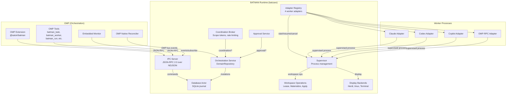
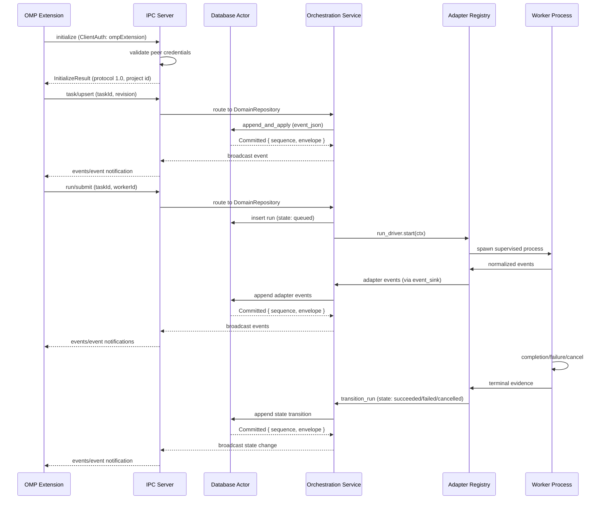

# Architecture

This document explains how the foundation of BATMAN is designed and why. It assumes you have read
the [README](../README.md) and want the engineering detail behind it.

**Related ADRs:** [0001](adr/0001-omp-extension-with-separate-rust-daemon.md),
[0002](adr/0002-rust-canonical-protocol-with-generated-bindings.md),
[0003](adr/0003-sqlite-as-the-sole-persistence-engine.md),
[0004](adr/0004-json-rpc-2-over-bounded-ndjson-on-a-unix-socket.md),
[0005](adr/0005-single-thread-actor-owns-the-sqlite-connection.md),
[0006](adr/0006-type-enforced-redaction-boundary.md),
[0007](adr/0007-repository-scoped-singleton-via-kernel-flock.md),
[0008](adr/0008-connect-or-spawn-with-idle-self-shutdown.md),
[0009](adr/0009-role-based-authorization-from-the-connection-not-per-call.md),
[0011](adr/0011-omp-retains-task-graph-authority.md),
[0012](adr/0012-explicit-run-lifecycle-relation-runtime-evidence-only.md),
[0013](adr/0013-injectable-run-driver-seam-fake-by-default.md),
[0016](adr/0016-coordination-scope-tokens-bound-to-run-and-pid-ancestry.md),
[0017](adr/0017-record-before-delivery-message-semantics.md),
[0019](adr/0019-monitor-is-one-reducer-over-replay-and-live-no-separate-modes.md),
[0020](adr/0020-per-mutation-event-broadcast-is-not-optional.md),
[0021](adr/0021-shared-client-authenticates-with-the-union-of-required-roles.md)

## 0. System Overview



**Key components:**
- **OMP Extension**: TypeScript extension registering tools and commands with OMP
- **BATMAN Runtime**: Rust daemon (`batcave`) handling worker supervision, persistence, and IPC
- **Worker Processes**: Supervised vendor CLI processes (Claude, Codex, Copilot, OMP-RPC)
- **Communication**: JSON-RPC 2.0 over bounded NDJSON on Unix sockets

## 1. The boundary: OMP vs. BATMAN

| Concern | Owner |
|---|---|
| Task intake, task graph, scheduling, worker selection | OMP |
| Approvals, policy, merge/reject decisions, synthesis | OMP |
| Worker process supervision, adapter protocols | BATMAN runtime (`batcave`) |
| Durable event/state persistence and recovery | BATMAN runtime |
| Workspace mechanics requested by OMP, display subscriptions | BATMAN runtime |
| Model-callable tools, commands, UI inside OMP | BATMAN extension (`@satori/batman`) |

The extension is not process-isolated inside OMP, so it never owns the only durable copy of any
state — durability always lives in the daemon's SQLite journal.

## 2. The wire contract and code generation

`crates/protocol` is the single source of truth for every type that crosses the socket (see
[ADR-0002](adr/0002-rust-canonical-protocol-with-generated-bindings.md)). Each wire type derives
`Serialize`, `Deserialize`, `JsonSchema` (schemars 1.x), and `TS` (ts-rs 11.x), and is annotated
`#[serde(rename_all = "camelCase", deny_unknown_fields)]` — the wire is camelCase and strict in
both directions.

Modules:

- `ids.rs` — UUID-v7-backed string newtypes (`ProjectId`, `TaskId`, `WorkerId`, `RunId`,
  `OperationId`, `MessageId`, `ApprovalId`, `ArtifactId`), generated by one macro.
- `version.rs` — `ProtocolVersion { major, minor }` and `VersionRange { min, max }`.
- `rpc.rs` — JSON-RPC envelopes (`JsonRpcRequest<P>`, `JsonRpcResponse<R>`,
  `JsonRpcErrorResponse`, `JsonRpcNotification`), `InitializeParams`/`InitializeResult`,
  `ClientAuth` (role-tagged), `RuntimeStatus`, `BatmanMethod`, and the `error_code` constants.
- `event.rs` — `EventEnvelope`, `RuntimeEvent` (adjacently tagged as
  `{ "type": ..., "payload": ... }`), `Timestamp` (canonical UTC RFC 3339 string),
  `ContentClass`/`Classified<T>`.

`cargo run -p batman-xtask -- generate` (or `bun run generate`) produces:

- `packages/protocol-ts/schema/batman.schema.json` — one JSON Schema 2020-12 document generated
  from a `ProtocolDocument` root struct that references every request/result/event type.
- `packages/protocol-ts/src/generated/*.ts` — ts-rs bindings, one file per type, exported through
  `packages/protocol-ts/src/index.ts`.

Generation is deterministic (pretty JSON + trailing newline, stable ordering, stale files removed
first). `generate --check` regenerates into a temp directory and byte-compares against the
committed output; `bun run check` runs it, so drift fails CI. **Never hand-edit generated files.**
Note that `crates/protocol/bindings/` (ts-rs's default test-time output directory) is gitignored
scratch — the real bindings live only under `packages/protocol-ts/`.

Cross-language agreement is pinned by golden fixtures in `fixtures/`:

- `fixtures/protocol/initialize.{request,response}.json` — deserialized through the Rust types in
  `crates/protocol/tests/fixtures.rs` and type-checked in `packages/protocol-ts/src/schema.test.ts`.
- `fixtures/state/state-root-cases.json` — state-root precedence, asserted by both languages.
- `fixtures/repo-id/repo-id-cases.json` — repository-id hashing, asserted by both languages.

## 3. Repository identity and state paths

State never lives in the repository. It lives under
`<state root>/repos/<repository-id>/`, where the state root resolves with identical precedence in
Rust (`security::StateRoot::resolve(env, home)`) and TypeScript (`resolveStateRoot(env, home)`):

1. `BATMAN_STATE_DIR` (must be absolute),
2. `$XDG_STATE_HOME/omp/batman` when `XDG_STATE_HOME` is set (must be absolute),
3. `$HOME/${PI_CONFIG_DIR:-.omp}/orchestrator`.

Both resolvers take the environment and home as explicit parameters — no process-global reads — so
tests drive them from fixtures.

`RuntimePaths::resolve(state_root, repository)` (`crates/runtime/src/paths.rs`) canonicalizes the
repository path, walks lexical parents for a `.git` marker (directory **or** file, so git worktrees
work; a symlink counts even if broken), and computes:

- **repository-id** — lowercase hex SHA-256 of the canonical UTF-8 root path, truncated to 32 hex
  chars (`repository_id_from_canonical_root`). TypeScript mirrors this in
  `runtime.ts:repositoryIdFromRoot`, guarded by the shared fixture.
- **project id** — a stable `ProjectId` derived from the first 16 bytes of the same digest,
  formatted as a UUID. Stable across restarts by construction.

The per-repository directory holds `runtime.sock`, `runtime.lock`, `runtime.db`, `runtime.log`, and
`artifacts/`. Directories are created atomically with mode `0700` and files with `0600`
(`security::ensure_private_dir` / `ensure_private_file` — create-with-mode, not create-then-chmod,
so there is no permissions race window). Non-UTF-8 canonical paths and non-private roots are
rejected with typed errors.

## 4. The SQLite journal and the database actor

One `rusqlite::Connection` is owned by one dedicated `std::thread` (`db/actor.rs`) (see
[ADR-0005](adr/0005-single-thread-actor-owns-the-sqlite-connection.md)). Async code talks to it
through a bounded `tokio::sync::mpsc` command channel; each command carries a `oneshot` reply
sender. Every write command replies only **after** its transaction commits.

Connection configuration (asserted by tests, not just set):

```sql
PRAGMA journal_mode=WAL;
PRAGMA foreign_keys=ON;
PRAGMA busy_timeout=5000;
PRAGMA synchronous=FULL;
```

Migration 1 (applied atomically via `rusqlite_migration`) creates two tables:

- `events(sequence INTEGER PRIMARY KEY, timestamp, project_id, run_id, event_json)` — the
  append-only journal. `sequence` aliases the rowid, so it is monotonic and `SELECT MAX(sequence)`
  is the tip (`DatabaseHandle::max_sequence`).
- `operations(operation_id PK, kind, intent_json, requested_at, acknowledged_at,
  acknowledgement_json)` — the intent ledger. `record_operation_intent` is written **before** a
  side effect is attempted; `acknowledge_operation` after it completes;
  `incomplete_operations()` returns unacknowledged intents after a restart so recovery can
  reconcile them.

**Known limitation:** The `events` table still only stores `run_id`, not `task_id`/`worker_id`/`parent_worker_id`/`vendor_event_ref` (`source` is still hardcoded `runtime`). A *live* `events/event` notification's envelope carries `task_id`/`worker_id` (§11's `append_and_apply` sets them from its caller's parameters), but a *replayed* one from `events/replay` always has them `None` — `ipc/connection.rs::replay()` can only reconstruct an envelope from what the `events` table's columns hold. The monitor (§17) is unaffected because it reads the inner `RuntimeEvent` variant's own `task_id`/`worker_id` fields (always present, part of the payload), never the outer envelope's convenience fields — but any future consumer that filters `events/replay` by the envelope's `task_id`/`worker_id` will get silently wrong (empty) results. See [Known Limitations](known-limitations.md#events-table-missing-columns) for full details.

`DatabaseHandle` API: `start`, `append_event`, `replay_events(after_sequence)`, `max_sequence`,
`record_operation_intent`, `acknowledge_operation`, `incomplete_operations`, `diagnostics`,
`shutdown`. Shutdown drains the channel, closes the connection, and joins the actor thread (via
`spawn_blocking`, callable from any handle clone).

## 5. The redaction boundary

This is the security core (see [ADR-0006](adr/0006-type-enforced-redaction-boundary.md)). The
rule is *redact before durable persistence*, enforced by the type system rather than by convention
(`security/redaction.rs`):

- Raw, possibly-secret-bearing input is modeled as `RawRuntimeEvent`, whose content fields are
  `Classified<String>` with a `ContentClass` of `Visible`, `Thinking`, or `Secret`.
- `Redactor::sanitize(raw) -> PersistableEvent` **drops** `Thinking` and `Secret` fragments
  entirely, and masks built-in regex matches (API-key/bearer-token shapes) inside visible text as
  `[REDACTED:<rule-id>]`. Rules are compiled once at startup.
- `PersistableEvent` and `SanitizedJson` have private fields and no public constructor. They can
  only be produced by the `Redactor`, and they are the **only** types the database actor accepts
  for event appends and operation intent/acknowledgement payloads. There is no raw-string or
  `serde_json::Value` append API.
- `Classified<T>` has a hand-written `Debug` impl that prints `<redacted>` for non-visible values,
  so an accidental `tracing::debug!(?raw_event)` cannot leak content either.
- The daemon's own tracing never logs event payloads — only metadata like sequence numbers.

`crates/runtime/tests/redaction_boundary.rs` proves the property end to end: it pushes a fixture
containing visible text, a secret token, a thinking block, and an API-key-shaped string through the
real append path, then byte-scans `runtime.db`, the WAL file, `runtime.log`, and the replay output.
Visible text must survive; every raw secret/thinking byte must be absent from all four surfaces.

## 6. IPC: JSON-RPC 2.0 over bounded NDJSON

The daemon listens on an owner-only Unix socket (`ipc/server.rs`, `ipc/connection.rs`) (see
[ADR-0004](adr/0004-json-rpc-2-over-bounded-ndjson-on-a-unix-socket.md) and
[ADR-0009](adr/0009-role-based-authorization-from-the-connection-not-per-call.md)). Transport
rules:

- **Admission before parsing.** After `accept()`, the peer's UID is read (SO_PEERCRED on Linux,
  LOCAL_PEERCRED/getpeereid on macOS, injectable via `PeerCredentialReader` for tests). A mismatch
  drops the connection before a single byte is parsed as JSON. Where peer credentials are
  unavailable, startup fails closed unless the owner-only directory/socket permission check passes,
  and the limitation is reported as `RuntimeCapabilities.peerCredentialsVerified = false`.
- **Bounded frames.** Newline-delimited JSON with a 4 MiB hard cap before initialization
  (`LinesCodec::new_with_max_length`). `initialize` negotiates
  `maxFrameBytes = min(client offer, runtime max)`; offers below the 64 KiB protocol floor are
  rejected with `INVALID_PARAMS`. After negotiation both peers enforce the cap on **every inbound
  and outbound frame**, byte-exact (the TypeScript client counts `Buffer.byteLength`, matching
  Rust). An oversized frame produces a diagnostic and closes the connection.
- **One reader, one serialized writer** per connection; the writer is fed by a bounded channel so
  event notifications and RPC responses cannot interleave mid-frame. Database transactions are
  never held across socket I/O (the actor commits internally).

Session rules:

- The first request must be `initialize` (`InitializeParams`: client info, supported version
  range, repository identity, `ClientAuth`, capabilities, optional `lastSequence`). Any other
  method first returns `NOT_INITIALIZED` (-32001). Non-overlapping version ranges return
  `INCOMPATIBLE_VERSION` (-32002). Successful initialization returns protocol `1.0`, the canonical
  project id, the negotiated capabilities, the caller's effective role, its allowed method names,
  and `nextSequence`.
- **Roles.** `ClientAuth` is internally tagged by `role` with disjoint strict fields:
  `ompExtension { instanceId, agentDirectory }`, `workerMcp { instanceId, scopeToken }`,
  `display { instanceId }`. Dispatch tables are built from the authenticated `ClientPrincipal`,
  never from client-supplied method names; methods outside the caller's role table return
  `METHOD_NOT_FOUND`, indistinguishable from nonexistent methods. At foundation scope:
  ompExtension gets everything implemented, display gets status + event methods, workerMcp gets
  status only.
- `ompExtension` must present an absolute, existing, canonicalizable agent directory owned by the
  current user. `workerMcp` must pass an injectable `WorkerCredentialVerifier`
  (`RejectAllWorkerVerifier` by default — the credential store arrives in a later milestone).
- Implemented methods: `initialize`, `runtime/status`, `events/subscribe`, `events/replay`,
  `runtime/shutdown`. Events are pushed as `events/event` notifications carrying `EventEnvelope`;
  `events/replay(afterSequence)` returns committed events with `sequence > afterSequence`.
- Error codes: standard JSON-RPC (-32700 … -32603) plus application codes
  `NOT_INITIALIZED=-32001`, `INCOMPATIBLE_VERSION=-32002`, `CAPABILITY_UNSUPPORTED=-32003`,
  `SEQUENCE_GONE=-32004`.

The TypeScript side (`packages/extension/src/client.ts`) mirrors all of this: `node:net` socket,
incremental UTF-8 buffer, monotonically increasing string request ids, a
`Map<string, PendingRequest>` correlation table, and Ajv 2020 validation (compiled once in
`packages/protocol-ts/src/validate.ts` with `strict: true`, `allErrors: true`,
`coerceTypes: false`, `removeAdditional: false`, `useDefaults: false`) of **every** inbound
message — a response with an unknown field is rejected before extension logic ever sees it.

**Lesson from smoke testing:** A cached client shared across callers with different role needs must authenticate with the *union* of every role its callers need, not whatever the first caller happened to need. See [Engineering Lessons](engineering-lessons.md#cached-client-must-authenticate-with-the-union-of-all-roles) for full details.

**Known limitation:** Subscription forwarder tasks for closed connections are reaped lazily on the next event broadcast; harmless in practice since a closed connection's own `events_rx.recv()` loop (`spawn_subscription`) exits on its own `Err` the next time anything is broadcast. See [Known Limitations](known-limitations.md#subscription-forwarder-tasks-for-closed-connections-are-reaped-lazily) for full details.

## 7. Daemon lifecycle

Daemon lifecycle (see [ADR-0007](adr/0007-repository-scoped-singleton-via-kernel-flock.md) and
[ADR-0008](adr/0008-connect-or-spawn-with-idle-self-shutdown.md)):

- **Singleton via kernel flock.** `serve` opens a persistent `runtime.lock` (never deleted on the
  contended path) and takes `flock(LOCK_EX | LOCK_NB)`. Exactly one racer wins; the loser reads the
  winner's metadata (pid, instance token, socket path, version, project id — written under the
  held lock) and exits with code **73** printing machine-readable `already_running` JSON on stdout.
  Staleness is implicit: if the owner crashes, the kernel releases the flock and the next starter
  simply acquires it. There is no remove-then-recreate window and no pid-recycling hazard
  (`stop` probes liveness by attempting the flock, not by `kill(pid, 0)`).
- **Idle shutdown.** With `--idle-seconds N`, the daemon exits after N seconds with zero
  connections and zero active runs; any live client suppresses the timer and disconnecting
  restarts it.
- **Graceful stop.** SIGTERM (sent by `batcave stop` after confirming the flock is held) and the
  in-band `runtime/shutdown` RPC converge on one path: append a redacted `runtimeStopping` event
  (awaited to commit), shut down the database actor cleanly (logged as `db_actor_closed`), remove
  the socket, release the lock, exit 0. The socket disappearing therefore guarantees the journal
  was closed.
- **Logging.** Detached daemons write structured JSON tracing records to `runtime.log` (0600);
  `--foreground` writes the same records to stderr. Startup emits a `runtime_started` record.

On the TypeScript side, `ensureRuntime(options)` (`packages/extension/src/runtime.ts`) connects
first; if no daemon is reachable it selects a binary — a validated `OMP_BATMAN_BINARY` override
(absolute, canonical, regular, executable; each violation fails **before** spawn with a typed
`BinarySelectionError`) or the packaged-binary resolver — then spawns it detached
(`spawn(binary, buildServeArgs(opts), { detached: true, stdio: "ignore" }).unref()`, deliberately
omitting `--foreground` so the daemon owns `runtime.log`) and retries connecting with bounded
exponential backoff for at most 5 seconds. If another caller won the startup race, it connects to
the winner instead of failing.

## 8. Platform packaging

Platform packaging (see [ADR-0010](adr/0010-platform-binaries-as-npm-optional-leaf-packages.md)):

`resolveBatcave(platform, arch, libc, env)` (`packages/extension/src/platform.ts`) maps the four
supported tuples to leaf packages (`@satori/batman-darwin-arm64`, `-darwin-x64`,
`-linux-arm64-gnu`, `-linux-x64-gnu`; npm `optionalDependencies` of `@satori/batman`) and rejects
everything else with a typed `UnsupportedPlatformError`. For a packaged binary it verifies the
SHA-256 in the leaf's `manifest.json` and requires the leaf version to equal the extension version
before returning; a corrupted binary fails with `BinaryIntegrityError` before any spawn. A valid
`OMP_BATMAN_BINARY` override bypasses all of that and reports `source: "override"`.

`cargo run -p batman-xtask -- package --target <triple> --binary <path>` installs a built binary
into the matching leaf (`bin/batcave`, mode 0755) and writes a deterministic
`manifest.json` (`{name, version, target, sha256, sizeBytes}`). No binaries are committed to git;
signing is a release-milestone concern.

## 9. The OMP surface

The OMP surface (see [ADR-0011](adr/0011-omp-retains-task-graph-authority.md)):

`packages/extension/src/index.ts` registers exactly one tool and one command with the OMP
`ExtensionAPI`:

- tool `batman_status` (parameters: `pi.zod.object({})`),
- command `/batman-status`.

Both call the same `getRuntimeStatus(ctx)` (`status.ts`), which reuses a cached `BatmanClient` or
runs `ensureRuntime`, requests `runtime/status`, and returns concise text in `content` plus the
Ajv-validated `RuntimeStatus` in `details`. On failure it returns `isError: true` with a
machine-readable `code` (including `checksum-mismatch`, `version-mismatch`,
`unsupported-platform`, or binary-selection codes), a **generic** message, and a runnable
`doctorCommand` — never stack traces, filesystem paths, or environment values. Context assembly
(state root, repository detection, binary resolver wiring, `DEFAULT_IDLE_SECONDS = 1800`) lives in
`context.ts`.

Since the orchestration extension, `index.ts` also wires the orchestration tools (§13), the
OMP-native reconciler (§14), and the embedded monitor (§17) — this section covers only the
foundation-era status surface `batman_status` reuses.

**Lesson from smoke testing:** A static `import ... with { type: "json" }` at module scope can hang the extension or corrupt `bun test`. See [Engineering Lessons](engineering-lessons.md#never-use-with-type-json-imports-at-extension-load-time) for full details.

## 10. Domain records and lifecycle

Domain records and lifecycle (see [ADR-0011](adr/0011-omp-retains-task-graph-authority.md) and
[ADR-0012](adr/0012-explicit-run-lifecycle-relation-runtime-evidence-only.md)):

`crates/protocol/src/{task,worker,run,message,approval}.rs` define the orchestration domain's
canonical wire types, all `camelCase` + `deny_unknown_fields` like every other protocol type:

- `TaskRef { ownerClientInstanceId, revision }` — OMP-owned intent: an opaque owner identity and
  a monotonic revision. Batman never edits this; `reconcile/omp` only ever rebinds
  `ownerClientInstanceId` when the revision matches.
- `WorkerProfileRef { id, fingerprint, adapter, model, permissionEnvelope }` and `Worker { workerId,
  profileRef, parentWorkerId, createdAt }` — an immutable harness identity; later adapter
  configuration resolves and stores a full profile snapshot without changing these identity
  fields. `parentWorkerId` supports nested/child workers.
- `Run { runId, taskId, workerId, state, flags, vendorSessionId, startedAt, completedAt }` and
  `RunSpec` — one supervised execution of a task by a worker.
- `RunState` — ten variants (`queued`, `starting`, `working`, `waitingUser`, `waitingPeer`,
  `paused`, `succeeded`, `failed`, `cancelled`, `lost`) with `can_transition_to` enforcing the
  canonical lifecycle relation and `is_terminal()` for the four sink states. **Only the runtime
  applies an edge, and only after process/protocol evidence** — OMP may request cancellation, but
  the state changes only when the adapter acknowledges it or the supervised process supplies
  terminal evidence. There is no generic pause/resume command: entering `paused` and
  `paused -> working` both require correlated adapter evidence.
- `RunFlags` — six independent booleans (`degradedControl`, `needsReconciliation`,
  `protocolUnhealthy`, `policyQuarantined`, `workspaceDirty`, `childrenActive`), never inferred
  from state.
- `RunMessage`/`MessageKind` (`assign`, `steer`, `followUp`, `question`, `answer`, `peerMessage`,
  `approvalDecision`, `cancel`, `shutdown`) and `DeliveryState` (`recorded`, `sent`,
  `acknowledged`, `failed`, `unknown`) — see §15 for the broker that drives these.
- `ApprovalRequest` and the correlated decision flow — see §16.

`crates/protocol/src/method.rs` extends `BatmanMethod` with `task/upsert|get`,
`worker/create|list|get`, `run/submit|list|get|retry|cancel`, `message/send|list`,
`approval/list|decide`, `coordination/child/list|decide`, and `reconcile/omp` — all registered
only in the `ompExtension` role table (§6). `crates/protocol/src/event.rs`'s `RuntimeEvent` gained
`TaskEvent`, `WorkerEvent`, `RunEvent`, `RunFlagsEvent`, `MessageEvent`, `ApprovalEvent`,
`ChildEvent`, and `ReconcileEvent` variants — one event per record creation, lifecycle transition,
flag change, message-delivery change, and approval request/decision.

The runtime implements four worker adapters in `crates/runtime/src/adapter/`: `ClaudeAdapter`,
`CodexAdapter`, `CopilotAdapter`, and `OmpRpcAdapter`. Each adapter implements the `Adapter`
trait and is managed by an `AdapterRegistry` that implements `RunDriver`. The registry resolves
worker profiles, gates start on conformance-derived effective capabilities through an injected
`AdapterAuthorization`, and owns adapters for the run's lifetime. Production defaults to
`DenyByDefaultAuthorization` unless the `DevOverrideAuthorization` is explicitly enabled for
development; the `PolicyEvaluator` from the Hardening plan is now integrated as the production
authorization mechanism, enforcing model allowlists, concurrency ceilings, and nested worker policies.

## 11. Projection persistence

Projection persistence (see [ADR-0003](adr/0003-sqlite-as-the-sole-persistence-engine.md) and
[ADR-0020](adr/0020-per-mutation-event-broadcast-is-not-optional.md)):

Migration 2 (`crates/runtime/src/db/migrations.rs`) adds six normalized tables —
`worker_profiles`, `tasks`, `workers`, `runs`, `messages`, `approvals` — alongside the append-only
`events` journal from §4. `runs.vendor_session_id` is a plain column (the plan's separate
`vendor_sessions` table was simplified away; nothing needed it as its own entity yet). Foreign
keys enforce referential integrity (`workers.profile_id -> worker_profiles`, `runs.task_id/
worker_id -> tasks/workers`, `messages.run_id -> runs`, `approvals.run_id -> runs`), and
`PRAGMA foreign_keys=ON` (§4) makes this fail fast rather than silently.

`crates/runtime/src/domain/repository.rs`'s `DomainRepository` is the only way to mutate these
tables. Every command runs through `append_and_apply`, one SQLite transaction: insert the event
row (placeholder `event_json`), learn the assigned `sequence` from the rowid, rewrite `event_json`
with the **bare `RuntimeEvent`** (not the full envelope — see §18 for why that distinction is
load-bearing), run the caller's projection-update closure, then commit. A failed projection update
rolls back the event insert too — the journal and its projections can never diverge.
`append_and_apply` returns `Committed { sequence, envelope }`: the full `EventEnvelope` (assembled
from the caller's `task_id`/`worker_id`/`run_id` plus the columns just written) is handed back so
the service layer can broadcast it (§18).

**Lesson from smoke testing:** A durable mutation must broadcast the same event it just committed, in the same call. See [Engineering Lessons](engineering-lessons.md#durable-mutations-must-broadcast-the-same-event-they-just-committed) for full details, including regression tests (`events_replay_round_trips_committed_mutation_events` and `events_subscribe_delivers_live_notifications_for_orchestration_mutations`).

`crates/runtime/src/domain/transitions.rs::check_transition` validates every `RunState` edge
against `RunState::can_transition_to` before `DomainRepository::transition_run` appends anything;
an illegal edge (including every self-transition and every edge out of a terminal state) returns
`TransitionError::Illegal` and appends nothing.

## 12. The orchestration RPC service

Orchestration RPC service:

`crates/runtime/src/service/orchestration.rs`'s `OrchestrationService` routes every method from
§10 to a typed `DomainRepository` command (mutations) or a read-only query closure
(`service/query.rs`), translating results and errors to JSON-RPC shapes. It holds no state beyond
its `db`/`project_id`/an optional `run_driver`/an `ApprovalService` (§16) — every command borrows
the shared `DatabaseHandle` and commits on the actor thread (§4).

`task/upsert` is idempotent for a repeated identical revision and rejects a lower revision than
what is stored; `reconcile/omp` rebinds `ownerClientInstanceId` only when the caller's `taskId` and
revision match what's stored, and journals the old/new owner ids. `run/retry` takes a prior
`RunId` in a terminal state and a new `WorkerId`; the result always carries a distinct `RunId` and
the same `TaskId` — a retry is never an in-place resurrection.

`run/submit` records the run (`queued`) and only then calls the injected `RunDriver` seam
(`service/run_driver.rs`). The `AdapterRegistry` implements `RunDriver` against the four real
worker adapters (Claude/Codex/Copilot/OMP-RPC); production wiring is configured via
`ServerConfig::adapter_registry`. Without an adapter registry, `run/submit` returns application
error `adapter_unavailable` **after** the queued run is durably committed — it never pretends the
run started and never drops it. Orchestration tests inject `FakeRunDriver`, which drives
`queued -> starting -> working` through the same domain-repository transitions a real adapter
would use.

## 13. OMP orchestration tools

OMP orchestration tools (see [ADR-0014](adr/0014-flat-op-discriminator-over-zod-discriminated-unions.md)):

`packages/extension/src/tools/{tasks,workers,runs,messages,approvals,reconcile}.ts` register six
deterministic OMP tools — `batman_task`, `batman_worker`, `batman_run`, `batman_message`,
`batman_approval`, `batman_reconcile` — each with an explicit discriminated `op` parameter
(`pi.zod`) and a `tools/shared.ts:callOrchestration(client, method, params)` execute body that
does exactly one thing: call the runtime method and shape the result as `{ content, details }`, or
map a `JsonRpcRemoteError` to a non-throwing `{ code, message, data, isError: true }`. No tool
selects a worker, retries, mutates OMP's own todos, approves, merges, or infers lifecycle state —
that authority stays with OMP and the runtime. Mutating tools (`batman_worker` create,
`batman_run` submit/cancel, `batman_approval` decide) use the `exec` approval tier;
`batman_approval` additionally overrides with a reason and never auto-approves.

`batman_task` is the `ompExtension`-authorized front for `task/upsert|get` — a *different*,
worker-scoped MCP tool of the same display name (out of scope this milestone; the coordination
broker in §15 is its runtime-side seam) runs in a different process/tool registry and exposes
read-only task context to a supervised vendor process.

## 14. OMP-native reconciliation

OMP-native reconciliation (see [ADR-0015](adr/0015-omp-native-facts-as-non-owning-mirror-lost-on-omission.md)):

`packages/extension/src/omp-native/{events,reconcile,types}.ts` mirrors OMP's own `task:subagent:
lifecycle|progress|event` bus events into Batman worker/run facts **without ever changing OMP's
state** — `index.ts` subscribes during `session_start` and unsubscribes during `session_shutdown`.
`OmpNativeReconciler` coalesces non-terminal `progress` updates for 150 ms but lets every terminal
lifecycle event (`succeeded`/`failed`/`lost`) through immediately, and never regresses a committed
terminal fact back to non-terminal from a stale update racing behind it.

`createOmpProcessEpoch()` mints one UUID per OMP process, included in every normalized
`OmpNativeAgentFact`. `reconcileAcrossRestart(priorFacts, currentEpoch)` is the mechanism behind
the plan's most specific invariant: an OMP-native, parent-scoped run that a new OMP process
doesn't re-report becomes `lost` — never `succeeded`, and never silently promoted into a
runtime-scoped `Run` row. `reconcileWithRuntime` calls `reconcile/omp` for the task a prior
`task/upsert` correlated with a subagent, so ownership rebinds before prior parent-scoped runs are
ever rendered as live again.

## 15. The coordination broker

The coordination broker (see [ADR-0016](adr/0016-coordination-scope-tokens-bound-to-run-and-pid-ancestry.md)
and [ADR-0017](adr/0017-record-before-delivery-message-semantics.md)):

`crates/protocol/src/coordination.rs` and `crates/runtime/src/coordination/{broker,rate_limit,
scope_token}.rs` implement the worker-safe messaging surface a supervised vendor process uses
through its scope-bound `workerMcp` connection — the connection layer authenticates via
`ClientAuth::WorkerMcp { instanceId, scopeToken }`, resolving it to a `ClientPrincipal` whose
`scoped_run_id` is the run identity every `coordination/*` call trusts, never a client-supplied
one (`ipc/connection.rs:dispatch_coordination`).

**Scope tokens.** `ScopeTokenStore::mint` is called immediately before launching the supervised
vendor process, binding a token to `{ projectId, taskId, workerId, runId, vendorProcessIdentity,
expiresAt }`. `verify(token, peer_pid)` checks the token's run binding, expiry, and that
`peer_pid` is a live descendant of the recorded vendor process (`PidAncestryChecker` — platforms
without trustworthy peer-process identity report `worker coordination as unsupported` rather than
accept an unverifiable reconnect); a restarted MCP subprocess in the same process tree may
re-initialize with the same token while the run/vendor process/expiry stay live, but replay from
an unrelated process, after vendor exit, or after expiry fails. Token bytes are never persisted or
logged.

**Record-before-delivery.** `CoordinationBroker::send` commits `recorded` (one durable event +
projection row) first, then attempts delivery and commits the outcome — `sent` today (no adapter
exists in this milestone to acknowledge further), `acknowledged`/`failed` once one does. A crash
between the two commits leaves a message `sent`/`recorded`;
`sweep_unacknowledged_as_unknown` (called once at startup, after journal recovery) settles any
such message to `unknown` — it never resends automatically. Bounds: payloads over
`COORDINATION_PAYLOAD_MAX_BYTES` (64 KiB) are rejected, `replyTo` must reference a visible prior
message on the same run, a run cannot address a task other than its own, and each sender is capped
at `COORDINATION_RATE_LIMIT_PER_MINUTE` (30) messages per rolling minute (`RATE_LIMITED`).

**Worker-safe operations:** `coordination/task`, `coordination/peers`, `coordination/send`,
`coordination/requestChild`, `coordination/publishArtifact`, `coordination/reportBlocked`,
`coordination/askPolicy` — registered only in the `workerMcp` role table (§6), rejecting any task
dependency, ownership, or merge mutation. `coordination/requestChild` only records
`ChildWorkerRequested` and transitions the requesting run to `waitingPeer`; OMP answers through
`coordination/child/decide` (an `ompExtension`-only method, §10): acceptance supplies the
OMP-created child task/worker/run ids and returns the parent to `working`, denial records
`ChildWorkerRequestDenied { reason }` and also returns the parent to `working`. The runtime owns
both transitions; OMP decides, Rust never does.

The coordination broker is fully implemented and tested (`crates/runtime/tests/coordination.rs`).
`ScopeTokenStore::new` is called from production code; `ServerConfig::default()`'s `worker_verifier`
is `RejectAllWorkerVerifier` (replaced by `PolicyEvaluator` in the Hardening plan), and
`AdapterRegistry::new` accepts an `Option<AdapterMcpConfig>` that is threaded into every adapter
construction. The broker is wired into the adapter start path via `AdapterRegistry::set_broker`.

## 16. The correlated approval flow

Correlated approval flow (see [ADR-0018](adr/0018-approval-decided-before-callback-never-re-ask-on-failure.md)):

`crates/runtime/src/approval/service.rs`'s `ApprovalService` is the seam an adapter calls when a
vendor process reports it needs human approval for an action (adapters are implemented this
milestone, so `crates/runtime/tests/approval.rs` exercises `request`/`decide` directly — there is
no `approval/request` RPC method). `request(ApprovalRequest)` atomically creates the request and
transitions the run `working -> waitingUser` in one durable event.

`approval/decide` (the one approval RPC method the extension calls, via `batman_approval`, §13)
enforces: only the connected `ompExtension` principal whose `instanceId` matches the task's
current owner may decide (`ApprovalError::Forbidden`); an identical repeated decision is
idempotent (`DecideOutcome::AlreadyDecided`); a conflicting second decision fails
(`ApprovalError::Conflict`); and a decision cannot target an already-settled run
(`ApprovalError::RunSettled`). The decision is recorded **before** the configured
`ApprovalCallback::acknowledge` runs; on success the run returns to `working`
(`DecideOutcome::Decided`), on failure the decision is kept and the run is marked
`protocolUnhealthy` instead of ever asking again (`DecideOutcome::DecidedCallbackFailed`) —
`NoopApprovalCallback` is the default with no adapter registry wired up.

`packages/extension/src/tools/approvals.ts` (`batman_approval`) lists pending approvals and
records a decision; `approval-ui.ts` shows the human dialog (worker, requested action, redacted
arguments, policy reason, approval id) only when OMP policy marks a decision
`humanRequired: true`, never auto-approving even under `tools.approvalMode` overrides.

## 17. The embedded monitor

The embedded monitor (see [ADR-0019](adr/0019-monitor-is-one-reducer-over-replay-and-live-no-separate-modes.md)):

`packages/extension/src/monitor/{model,render,controller}.ts` render `/batman` as a pure
event-reducer over the same durable stream every other client consumes:

- `model.ts::reduceEvent(state, envelope)` is a pure function: one row per `runId`, built from
  `RuntimeEvent`'s `TaskEvent`/`WorkerEvent`/`RunEvent`/`RunFlagsEvent`/`MessageEvent`/
  `ApprovalEvent`/`ChildEvent` variants. It never mutates `state`, is a no-op for a `sequence` not
  newer than the row's `lastAppliedSequence` (idempotent replay/resume), and never lets a raw
  message payload, thinking, or secret content reach the model — only kind-based labels derived
  from `RuntimeEventKind`.
- `render.ts` turns `MonitorState` into the widget's concise lines (at most 10 rows; a fuller view
  is always available via `/batman status <runId>`, never a silent truncation) and a per-run
  status detail.
- `controller.ts::registerMonitor` wires both into the live extension: on `session_start`, reads
  the last persisted sequence from the session's own `batman-monitor` custom entry
  (`pi.appendEntry`) and calls `client.subscribe(fromSequence, onEvent)` — which itself first
  drains `events/replay(afterSequence)` (rebuilding state from history) before delivering live
  `events/event` notifications, so there is no separate "replay mode": every event, replayed or
  live, flows through the same `reduceEvent`. `refresh()` re-renders the widget
  (`ctx.ui.setWidget`, `placement: "aboveEditor"`) and persists the new last-applied sequence after
  every applied event. If the runtime is unreachable at session start the monitor degrades to
  inactive rather than failing session startup; `/batman` retries the connection.
- `compat.ts::assertCompatiblePiCodingAgentVersion` is a **test-only** no-model compatibility
  check (`render.test.ts`) that the installed `@oh-my-pi/pi-coding-agent` falls within the
  `[17.0.7, 18.0.0)` range this monitor's `pi.appendEntry`/`ctx.ui.setWidget` usage is pinned to
  — see §9 for why it must never run at extension-load time.

## 18. Data flow: event lifecycle



**Key flows:**
1. **Initialization**: OMP extension authenticates via `ClientAuth::OmpExtension`, receives protocol capabilities and allowed methods
2. **Task submission**: OMP calls `task/upsert` → `run/submit` → adapter registry starts worker process
3. **Event broadcast**: Every durable mutation broadcasts the same event it committed, in the same call
4. **State transitions**: Only the runtime applies state edges, and only after process/protocol evidence

## 19. Known deferred items

Consciously deferred as non-blocking after review (tracked for later milestones). See [Known Limitations](known-limitations.md) for the full catalog with status updates.

**Status:** All items tracked in [Known Limitations](known-limitations.md).

## Appendix A: Quick Reference

This appendix provides fast access to common operations, error codes, and file paths without requiring a full read of the document.

### Common Operations

| Operation | Command |
|---|---|
| Generate TypeScript bindings | `cargo run -p batman-xtask -- generate` or `bun run generate` |
| Check for drift (CI) | `bun run check` |
| Package binary for platform | `cargo run -p batman-xtask -- package --target <triple> --binary <path>` |
| Start daemon (foreground) | `batcave serve --foreground` |
| Stop daemon | `batcave stop` |

### Key File Paths

| Purpose | Path |
|---|---|
| Protocol types (Rust) | `crates/protocol/src/*.rs` |
| Protocol types (TypeScript) | `packages/protocol-ts/src/generated/*.ts` |
| JSON Schema | `packages/protocol-ts/schema/batman.schema.json` |
| Database actor | `crates/runtime/src/db/actor.rs` |
| IPC server | `crates/runtime/src/ipc/server.rs` |
| IPC connection handler | `crates/runtime/src/ipc/connection.rs` |
| Extension entry point | `packages/extension/src/index.ts` |
| Runtime client | `packages/extension/src/client.ts` |
| Runtime launcher | `packages/extension/src/runtime.ts` |
| Platform resolver | `packages/extension/src/platform.ts` |
| Adapter registry | `crates/runtime/src/adapter/registry.rs` |
| Coordination broker | `crates/runtime/src/coordination/broker.rs` |
| Approval service | `crates/runtime/src/approval/service.rs` |
| Monitor controller | `packages/extension/src/monitor/controller.ts` |

### Error Codes

| Code | Meaning |
|---|---|
| `-32700` … `-32603` | Standard JSON-RPC errors |
| `-32001` | `NOT_INITIALIZED` — first request must be `initialize` |
| `-32002` | `INCOMPATIBLE_VERSION` — version ranges do not overlap |
| `-32003` | `CAPABILITY_UNSUPPORTED` — method not in caller's role table |
| `-32004` | `SEQUENCE_GONE` — requested sequence no longer available |
| `73` | Daemon exit code — already running (machine-readable JSON on stdout) |

### State Root Resolution

State lives under `<state root>/repos/<repository-id>/`, where the state root resolves with this precedence:

1. `BATMAN_STATE_DIR` (must be absolute)
2. `$XDG_STATE_HOME/omp/batman` when `XDG_STATE_HOME` is set (must be absolute)
3. `$HOME/${PI_CONFIG_DIR:-.omp}/orchestrator`

### Role Table Summary

| Role | Allowed Methods |
|---|---|
| `ompExtension` | All methods (superset) |
| `display` | `runtime/status`, `events/subscribe`, `events/replay` |
| `workerMcp` | `runtime/status` only |

**Note:** A cached connection shared across callers must authenticate as the *union* of all roles (see [Engineering Lessons](engineering-lessons.md#cached-client-must-authenticate-with-the-union-of-all-roles)).

### Regression Tests for Critical Invariants

| Invariant | Test |
|---|---|
| Events replay round-trips committed mutations | `events_replay_round_trips_committed_mutation_events` |
| Events subscribe delivers live notifications for mutations | `events_subscribe_delivers_live_notifications_for_orchestration_mutations` |
| Redaction boundary holds | `crates/runtime/tests/redaction_boundary.rs` |
| Coordination broker | `crates/runtime/tests/coordination.rs` |
| Approval flow | `crates/runtime/tests/approval.rs` |

Run with a test-runner timeout if you suspect a new mutation has regressed the broadcast invariant — the bug manifests as an infinite hang, not a clean failure.
